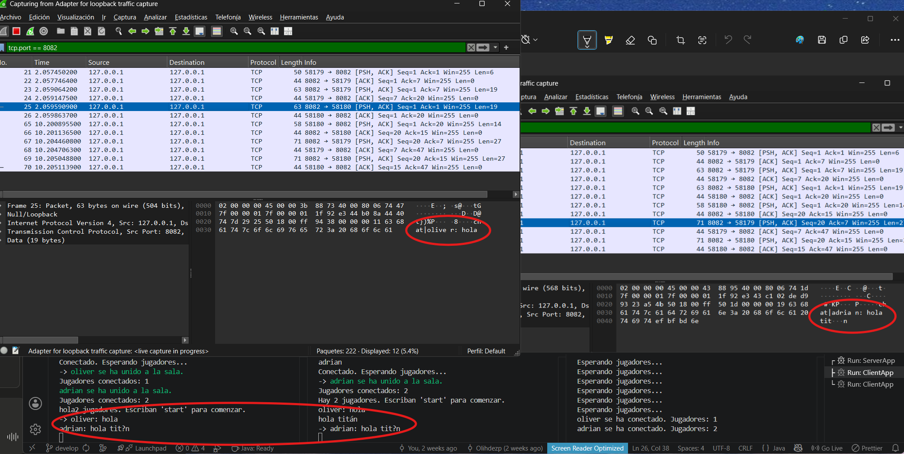
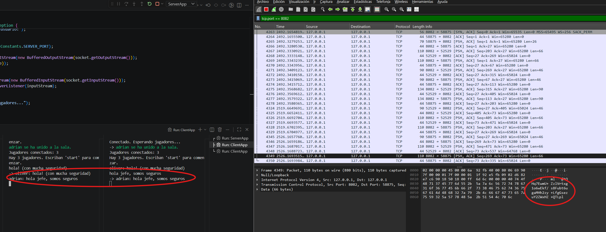

# UD3 – Práctica 2 – Seguridad en mi app cliente/servidor

Aplicación de trivia multijugador cliente/servidor con comunicación cifrada mediante AES-128.

## Índice

1. [Wireshark antes del cifrado](#1-wireshark-antes-del-cifrado)
2. [Clase de cifrado CryptoUtils](#2-clase-de-cifrado-cryptoutils)
3. [Modificaciones en cliente y servidor](#3-modificaciones-en-cliente-y-servidor)
4. [Wireshark después del cifrado](#4-wireshark-después-del-cifrado)
5. [Esquema de roles](#5-esquema-de-roles)

---

## 1. Wireshark antes del cifrado

Con Wireshark se capturó el tráfico TCP en el puerto 8082 antes de aplicar cifrado. Como se puede observar, los mensajes intercambiados entre cliente y servidor son completamente legibles (texto plano).



En la captura se aprecia el nombre de usuario y los mensajes de chat sin ningún tipo de protección, lo que representa una vulnerabilidad grave ante posibles ataques de interceptación (_man-in-the-middle_).

---

## 2. Clase de cifrado CryptoUtils

Se ha creado la clase `CryptoUtils` en el paquete `net.salesianos.utils` con dos métodos estáticos:

- `encrypt(String plainText)` → cifra el texto con AES-128 en modo ECB y lo devuelve en Base64.
- `decrypt(String encryptedText)` → descifra el texto Base64 y devuelve el texto original.

El algoritmo utilizado es **AES/ECB/PKCS5Padding** con una clave de 128 bits (16 bytes).

```java
public static String encrypt(String plainText) throws Exception {
    Cipher cipher = Cipher.getInstance("AES/ECB/PKCS5Padding");
    cipher.init(Cipher.ENCRYPT_MODE, getSecretKey());
    byte[] encryptedBytes = cipher.doFinal(plainText.getBytes(StandardCharsets.UTF_8));
    return Base64.getEncoder().encodeToString(encryptedBytes);
}
```

---

## 3. Modificaciones en cliente y servidor

### Servidor (`ServerApp.java`, `ClientHandler.java`)

- Al recibir la conexión de un cliente, el nombre se **descifra** antes de procesarlo.
- Los métodos `broadcast()` y `sendTo()` **cifran** cada mensaje antes de enviarlo por el socket.
- `ClientHandler` **descifra** cada mensaje recibido del cliente antes de procesarlo.

### Cliente (`ClientApp.java`, `ServerListener.java`)

- Al conectarse, el nombre de usuario se **cifra** antes de enviarlo.
- Cada mensaje escrito por el usuario se **cifra** antes de enviarlo al servidor.
- `ServerListener` **descifra** cada mensaje recibido del servidor antes de mostrarlo.

---

## 4. Wireshark después del cifrado

Tras aplicar el cifrado AES, se volvió a capturar el tráfico con Wireshark. Ahora los datos son completamente ilegibles: se muestran como cadenas Base64 sin ningún significado visible para un atacante.



Los mensajes ya no pueden ser interpretados aunque sean interceptados.

---

## 5. Esquema de roles

Se ha diseñado un esquema de seguridad basado en roles (RBAC) para una versión escalada de la aplicación.

➡️ [Ver esquema completo de roles](docs/ROLES.md)

### Resumen de roles

| Rol       | Descripción               |
| --------- | ------------------------- |
| ADMIN     | Control total del sistema |
| HOST      | Gestión de partidas       |
| PLAYER    | Jugador estándar          |
| SPECTATOR | Solo puede observar       |
